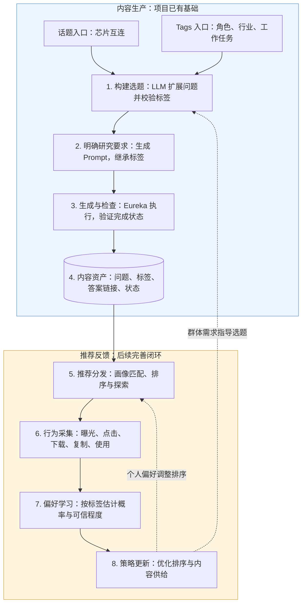

# 从话题与 Tags，到推荐内容库与用户需求学习

面向业务与技术负责人的流程说明。以“芯片互连方案怎么选”为例，把内容生产、推荐分发和行为反馈连成一条链路。

目标：用标签组织内容供给，再通过用户对内容的实际使用，逐步识别其工作兴趣和当前需求，同时优化推荐排序与后续选题。

“已有基础”指项目具备选题、研究要求生成、内容执行、完成状态校验与结构化导出能力；运营还需抽查内容质量。内容库在本项目主要体现为 JSON/CSV 内容资产，并非已验证完成线上数据库写入。项目已有曝光、点击及激活的分析材料；完整的深度行为采集、偏好模型和排序回写属于后续建设。

| 步骤 | 业务动作 | 技术实现或后续设计 | 贯穿例子 |
| --- | --- | --- | --- |
| 1. 构建选题 | 把宽泛话题变成有工作价值的问题，并明确适用受众。 | 统一标签目录；LLM 生成标题、描述与标签；程序检查分类及组合约束。也可从固定标签组合批量生成问题。 | 话题“芯片互连”扩展为“不同芯片互连方案在带宽、功耗和成本上如何取舍？”；目标受众为研发、电子制造、技术方案。 |
| 2. 明确研究要求 | 规定这篇内容需要回答什么、交付什么。 | 将选题转成研究 Prompt，继承原标签，补充研究重点与证据要求。 | 从产品设计视角比较方案，预期产出为方案对比表。 |
| 3. 生成与检查 | 批量产出可阅读、可使用的内容，并确认可用性。 | Eureka 执行研究，支持报告或 HTML；保存任务与分享标识，查询完成状态，支持中断恢复；运营抽查质量。 | 生成一份芯片互连方案对比报告，检查完成状态并抽查内容。 |
| 4. 沉淀内容资产 | 让每份内容都可以检索、复用和匹配。 | 当前保存结构化记录并导出产品 JSON；后续统一内容 ID，打通生成记录、标签版本、答案链接与产品内容表。 | 一条记录同时关联问题、研发受众、半导体领域、方案比较任务、对比表产出及报告链接。 |
| 5. 推荐分发 | 把合适的内容展示给有相关工作需求的人。 | 后续以用户主动填写的角色、行业、任务做初始匹配，再结合行为偏好排序，并保留探索内容。 | 用户主动填写“研发／电子制造／技术方案”，系统将该报告作为候选内容。 |
| 6. 行为采集 | 观察内容是否吸引用户、是否进入实际工作。 | 将有效曝光、点击、下载、复制、使用及任务完成关联到用户、内容、曝光记录和当时的标签版本。 | 用户点开报告、复制对比表，并基于报告启动后续研究任务。 |
| 7. 偏好学习 | 从多次交互中识别关注方向、工作方式与当前需求。 | 分动作统计标签转化率；结合初始信息、样本量与时间变化，估计用户对标签的偏好及可信程度。 | 多次交互后，系统获得“近期关注半导体方案比较、偏好可直接使用的对比表”的证据。 |
| 8. 策略更新 | 同时改善推荐匹配和下一批内容供给。 | 个人偏好用于调整候选排序；群体行为用于规划标签覆盖；通过 A/B 实验评估，并保留探索流量。 | 对该用户增加相关方案比较内容；若同类人群也持续使用，则扩大相关选题供给。 |

例子仅用于说明流程，不代表真实用户行为或实际研究结论。内容适合“研发人员”不等于点击者一定是研发人员；主动填写的身份信息与推断的兴趣、需求应分别保存。

## 后续优先补齐的工作

1. **打通内容与事件。** 使用统一内容 ID，将生成阶段的标签及版本传递到产品和行为记录；采集曝光 ID、用户或匿名访客 ID、内容 ID、时间、展示位置、策略版本与动作类型。当前产品导出字段还需要补齐完整受控标签和追溯标识。
2. **统一行为与指标口径。** 从首次曝光就开始采集。点击、下载、复制分别记录；“使用”落为可观测动作，例如基于内容启动任务、将内容应用到工作区；任务启动与任务完成分开。多次重复操作去重，延迟行为设定归因窗口，不能把尚未观察完的样本直接当成未转化。
3. **建立概率化偏好。** 数据少时更多参考用户主动输入、同类人群和上层标签；新证据到来后持续更新。记录近期偏好、长期偏好及可信程度，对旧行为逐步降权。没有曝光不等于不感兴趣，一次未点击也只是有限的反馈。
4. **验证并接回推荐。** 先离线分析，再小流量 A/B 实验。建议以有效使用、任务完成等业务结果为主要目标，CTR 和下载、复制用于解释中间环节；权重需由实际业务结果验证。可进一步采用上下文多臂老虎机，平衡已知偏好与新内容探索。[方法参考](https://arxiv.org/abs/1003.0146)

建议分别观察以下指标，并按同一时间窗、标签维度、人群和展示条件比较：

| 指标 | 建议定义 | 解释 |
| --- | --- | --- |
| 点击率 | 至少发生一次有效点击的曝光数 ÷ 有效曝光数 | 是否吸引用户进一步查看。 |
| 下载率／复制率 | 发生对应动作的去重阅读会话数 ÷ 有机会执行该动作的阅读会话数 | 内容是否被带走或用于后续工作；两种动作分别计算。 |
| 使用转化率 | 在归因窗口内至少产生一次已定义使用动作的曝光数 ÷ 具备完整观察窗口的有效曝光数 | 衡量推荐最终带来的使用价值。 |
| 任务完成率 | 已完成且可归因到推荐内容的任务数 ÷ 由推荐内容启动且观察窗口完整的任务数 | 衡量内容是否帮助推进工作。 |

标签使用频次是信号之一，也要同时看曝光分母与人群覆盖。例如 A 标签点击 30 次、曝光 1,000 次，B 标签点击 20 次、曝光 100 次，仅按点击数会高估 A。先按曝光量归一化，再比较位置、人群、时间和策略等条件；归一化本身不能消除全部推荐选择偏差。同一内容带有多个标签时，不能把一个动作当作多个相互独立的证据，也不能据此断言某个标签造成了转化。

## 数学上怎么称呼

业务名称建议使用 **“基于隐式反馈的用户偏好学习”**：用户没有直接打分，系统通过点击、下载、复制和使用等行为学习偏好。[隐式反馈推荐研究](https://yifanhu.net/PUB/cf.pdf)

若强调“结合初始画像，随着行为不断修正判断”，数学上更贴近 **贝叶斯推断／贝叶斯更新**：

\[
P(\text{偏好}\mid\text{行为、曝光情境})\propto P(\text{行为}\mid\text{偏好、曝光情境})\,P(\text{偏好})
\]

- **最大似然估计（MLE）**：寻找最能解释已观察行为的参数。在简化的独立同分布二元点击模型中，某标签 20 次有效曝光有 8 次点击，点击概率的 MLE 为 40%。这是该观察条件下的点击概率估计，不是“用户属于某职业的概率”。
- **贝叶斯更新**：在行为证据之外加入合理的先验，并保留估计的不确定性。取后验概率密度最大的参数值时，称为 **最大后验估计（MAP）**。贝叶斯方法也可以使用后验均值或完整后验，不必只取 MAP。[MLE 与 MAP 的区别](https://chrispiech.github.io/probabilityForComputerScientists/en/part5/map/)

一个仅用于理解的平滑例子：若点击概率先验为 Beta(2, 8)，观察到 8 次点击、12 次未点击后，后验为 Beta(10, 20)，后验均值约为 33.3%。这比直接把 40% 当作确定偏好更能体现初始信息与有限样本。这个简化模型只针对二元点击；真实系统需要分别处理动作、展示条件、时间变化和相关性。

适合放在汇报图旁的一句话：**通过用户行为持续更新标签偏好及可信程度，让推荐逐步从初始画像匹配，走向对实际工作需求的识别。**

## 项目依据

- [现有生产工作流与结构化导出](../README.md)
- [话题、受众、标签与用户画像的语义边界](../CONTEXT.md)
- [标签定义、组合校验与后续分析原则](../运营选题_第一阶段生成规则.md)
- [产品 JSON 导出字段](../src/recommendation_contents/plg_cli.py)
- [已有曝光、点击与激活分析](../visualization/build_recommendation_report.js)
